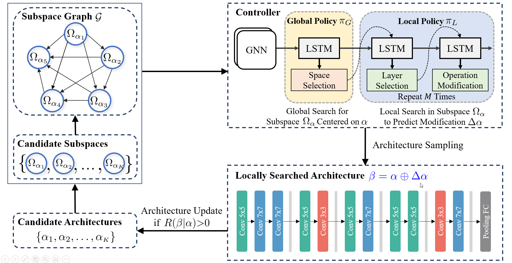

# Automatic Subspace Evoking for Efficient Neural Architecture Search


## Introduction

Neural Architecture Search (NAS) aims to automatically find effective architectures from a predefined search space. However, the search space is often extremely large. As a result, directly searching in such a large search space is non-trivial and also very time-consuming. To address the above issues, in each search step, we seek to limit the search space to a small but effective subspace to boost both the search performance and search efficiency. To this end, we propose a novel Neural Architecture Search method via Automatic Subspace Evoking (ASE-NAS) that finds promising architectures in automatically evoked subspaces. Specifically, we first perform a global search, i.e., automatic subspace evoking, to find a good subspace from a set of candidate subspaces. Then, we perform a local search within the searched subspace to find an effective architecture. More critically, we can further boost search performance by taking well-designed/searched architectures as the initial candidate subspaces. Extensive experiments show that our ASE-NAS not only greatly reduces the search cost but also finds better architectures than state-of-the-art methods in various benchmark search spaces.

<p align="center">

</p>

## Requirements

Please install all the requirements in `requirements.txt`.

## Data preparation

Download and extract ImageNet train and val images from http://image-net.org/.
The directory structure is the standard layout for the torchvision [`datasets.ImageFolder`](https://pytorch.org/docs/stable/torchvision/datasets.html#imagefolder), and the training and validation data is expected to be in the `train` folder and `val` folder respectively:

```
/path/to/imagenet/
  train/
    class1/
      img1.jpeg
    class2/
      img2.jpeg
  val/
    class1/
      img3.jpeg
    class/2
      img4.jpeg
```

## Training Method

TODO
