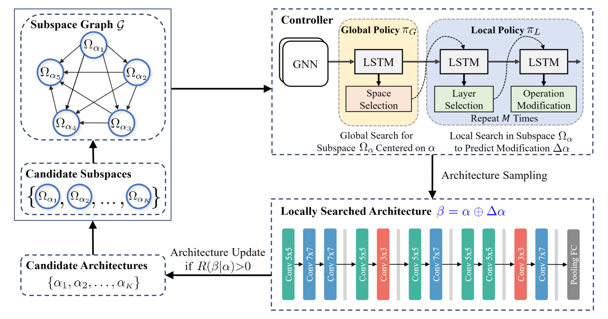
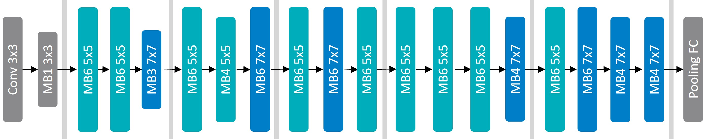
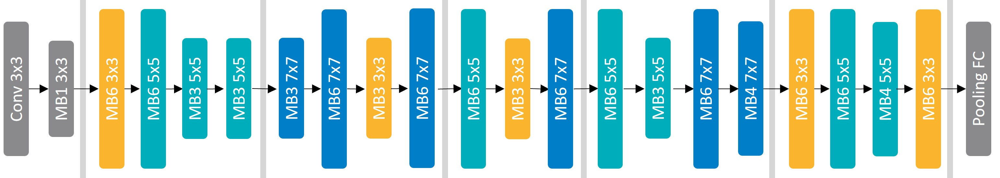

# Efficient Neural Architecture Search via Dominative Subspace Mining


## Introduction

Neural Architecture Search (NAS) aims to automatically find effective architectures within a predefined search space. However, the search space is often extremely large. As a result, directly searching in such a large search space is non-trivial and also very time-consuming. To address the above issues, in each search step, we seek to limit the search space to a small but effective subspace to boost both the search performance and search efficiency. To this end, we propose a novel Neural Architecture Search method via Dominative Subspace Mining (DSM-NAS) that finds promising architectures in automatically mined subspaces. Specifically, we first perform a global search, i.e., dominative subspace mining, to find a good subspace from a set of candidates. Then, we perform a local search within the mined subspace to find effective architectures. More critically, we further boost search performance by taking well-designed/searched architectures to initialize candidate subspaces. Experimental results demonstrate that DSM-NAS not only reduces the search cost but also discovers better architectures than state-of-the-art methods in various benchmark search spaces.

<p align="center">

</p>

## Requirements

Please install all the requirements in `requirements.txt`.

## Training Method

Train our DSM-NAS in NAS-Bench-201 search space with the following command:

```
bash entry/train_nas_201.sh
```

## Pretrained Models

We have released our DSM-NAS [pretrained model](https://github.com/chenyaofo/DSM-NAS/releases/tag/weights) on ImageNet.

You can use the following scripts to load the pretrained models:
```
import torch
model = torch.hub.load("chenyaofo/DSM-NAS", "dsm_nas")
```
The names of all the available models include `dsm_nas` and `dsm_nas_plus`.

We also provide a out-of-the-box script to evaluate the pretrained models on ImageNet and report the accuracy.
```
python -m entry.eval /path/to/imagenet
```
> `CN=true python -m entry.eval /path/to/imagenet` for China mainland users to address networking problem

>**Data preparation**. Download and extract ImageNet train and val images from http://image-net.org/.
The directory structure is the standard layout for the torchvision [`datasets.ImageFolder`](https://pytorch.org/docs/stable/torchvision/datasets.html#imagefolder), and the training and validation data is expected to be in the `train` folder and `val` folder respectively.

## Results

 - Results in NAS-Bench-201 search space. We report the accuracies of our methods on three benchmark datasets, namely CIFAR-10, CIFAR-100 and ImageNet-16-120.

| Method | CIFAR-10 | CIFAR-100 | ImageNet-16-120 |
| :-: | :-: | :-: | :-: |
| DSM-NAS | 94.23±0.22 | 72.76±0.80 | 46.13±0.67 |
| DSM-NAS+ | -- | 73.12±0.61 | 46.66±0.52 |

 - Results in MobileNet-like search space. We report the top-1 and top-5 accuracies on ImageNet and the corresponding MAdds.
 
| Method | Top-1 Acc. | Top-5 Acc. | MAdds (M) |
| :-: | :-: | :-: | :-: |
| DSM-NAS | 79.9 | 94.8 | 597 |
| DSM-NAS+ | 80.2 | 94.9 | 582 |

 - Visulizations of our DSM-NAS(+) searched in MobileNet-like search space.
 
<p align="center">

</p>
<p align="center">DSM-NAS</p>

<p align="center">

</p>
<p align="center">DSM-NAS+</p>
